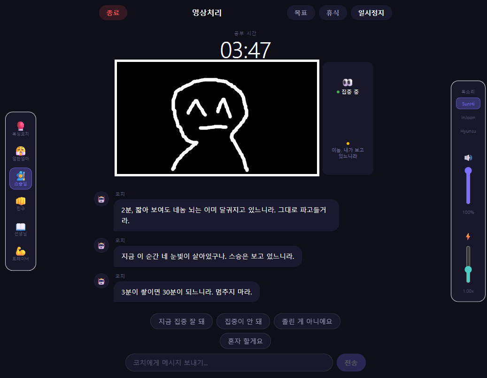

# Study Coach APP

AI 기반 실시간 공부 코칭 앱. 웹캠으로 집중도를 분석하고 LLM 코치가 맞춤 피드백을 제공합니다.



---

## 기능

- **실시간 얼굴 분석** — MediaPipe로 집중·졸음·자리비움 상태를 10초 단위로 감지
- **6가지 코치 페르소나** — 친구, 선생님, 트레이너, 복싱코치, 엄한 엄마, 엄한 스승(고어체)
- **적응형 체크 주기** — LLM이 사용자 상태에 맞춰 15~300초로 다음 코칭 간격을 직접 결정
- **음성 출력 (TTS)** — Edge TTS (SunHi / InJoon / Hyunsu) 및 OpenAI TTS 지원
- **빠른 응답 버튼** — "지금 집중 잘 돼", "집중이 안 돼", "혼자 할게요" 등으로 1탭 자기보고
- **목표·휴식 관리** — 목표 시간 설정, 휴식 모드, 마일스톤 알림 (5분 전, 1분 전, 달성)

---

## How to use?

### 1. 클론

```bash
git clone https://github.com/<your-username>/<repo-name>.git
cd "Study Coach APP develop"
```

### 2. 의존성 설치

```bash
npm install
```

### 3. 개발 서버 실행

```bash
cd apps/web
npm run dev
```

브라우저에서 `http://localhost:3000` 접속

---

## 설정

앱 실행 후 **설정** 페이지에서 LLM API 키를 입력하세요.

- **OpenAI** — `gpt-4o-mini` 등 사용 시 OpenAI API 키 입력
- **Anthropic** — `claude-3-5-haiku` 등 사용 시 Anthropic API 키 입력

API 키는 브라우저 로컬스토리지에만 저장되며 외부로 전송되지 않습니다.

---

## 요구사항

- Node.js 18 이상
- 웹캠

---

## Credits

- Edge TTS 백엔드: [msedge-tts](https://github.com/Migushthe2nd/MsEdgeTTS) (MIT, © 2023 Migushthe2nd)
- 얼굴·시선 분석: [MediaPipe Tasks Vision](https://developers.google.com/mediapipe) (Apache 2.0)
- LLM API: OpenAI, Anthropic
